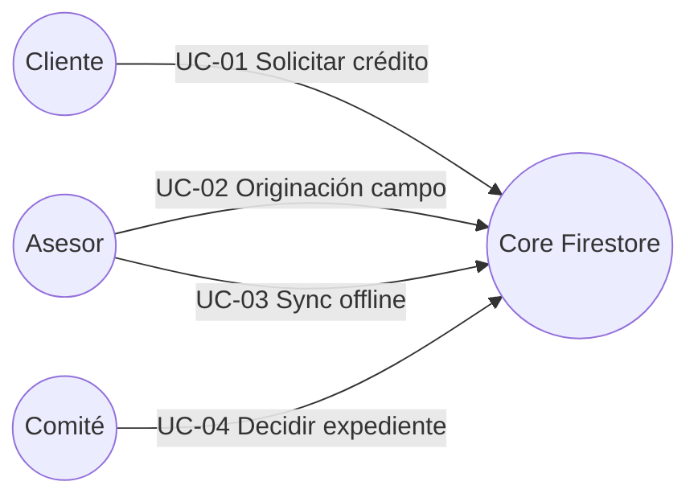
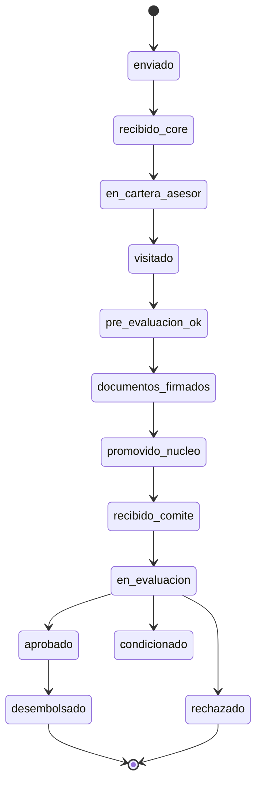
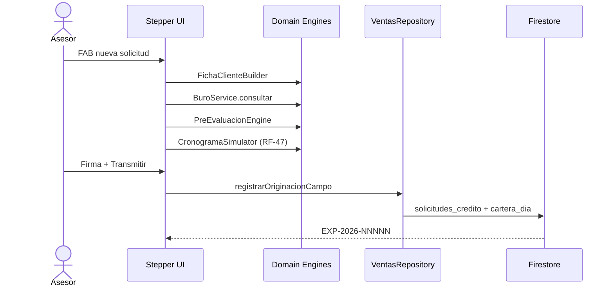
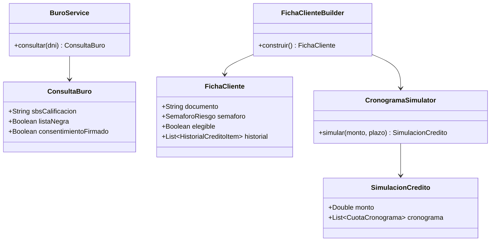

# Historias de Usuario y trazabilidad RF

**Proyecto:** Ecosistema CMAC Ica · **Versión:** 1.0.0

## Historias de Usuario (HU)

| ID | Como | Quiero | Para | App |
|----|------|--------|------|-----|
| HU-01 | Cliente | Registrarme e iniciar sesión con DNI | Acceder a home banking | Clientes |
| HU-02 | Cliente | Enviar solicitud de crédito | Obtener expediente EXP-YYYY-NNNNN | Clientes |
| HU-03 | Cliente | Ver mis solicitudes y timeline 8 pasos | Seguir el estado del crédito | Clientes |
| HU-04 | Asesor | Tomar solicitudes de la cola core | Gestionar cartera del día | Ventas |
| HU-05 | Asesor | Originación en campo con stepper | Capturar ficha, visita, buró, RF-47 | Ventas |
| HU-06 | Asesor | Trabajar offline con cartera local | Continuar en campo sin señal | Ventas |
| HU-07 | Supervisor | Consultar reportes consolidados API | Monitorear cartera (401/403 RBAC) | Ventas |
| HU-08 | Comité | Evaluar expedientes promovidos | Aprobar / condicionar / rechazar | Comité |
| HU-09 | Sistema | Bloquear login tras 5 intentos | Proteger cuentas | Todas |
| HU-10 | Sistema | Sincronizar outbox al reconectar | No perder visitas registradas offline | Ventas |

## Requisitos funcionales (RF) trazados

| RF | Descripción | HU | Implementación |
|----|-------------|-----|----------------|
| RF-01 | Registro/login cliente | HU-01 | `AuthRepository`, Firebase Auth |
| RF-02 | Solicitud crédito canal cliente | HU-02 | `SolicitudCreditoRepository.registrarSolicitud` |
| RF-03 | Timeline estados expediente | HU-03 | `SolicitudDetalleScreen`, `EstadoSolicitud` |
| RF-04 | Cola core → cartera asesor | HU-04 | `VentasRepository.tomarDeCola` |
| RF-05 | Ficha cliente + semáforo | HU-05 | `FichaClienteBuilder` |
| RF-06 | Pre-evaluación elegibilidad | HU-05 | `PreEvaluacionEngine` |
| RF-07 | Consulta buró SBS + lista negra | HU-05 | `BuroService` |
| **RF-47** | **Simulador cronograma francés** | **HU-05** | **`CronogramaSimulator`** |
| RF-08 | Originación fuerza ventas | HU-05 | `registrarOriginacionCampo` |
| RF-09 | Cartera offline-first | HU-06 | Room + `OfflineCarteraRepository` |
| RF-10 | Filtros/orden cartera | HU-06 | `CarteraFilters` |
| RF-11 | Reportes API JWT | HU-07 | `apiReportes` (403 asesor) |
| RF-12 | Decisión comité | HU-08 | Portal `SolicitudesTable` |
| RF-13 | RBAC custom claims | HU-09 | `syncUserRole`, reglas Firestore |
| RF-14 | Bloqueo 5 intentos | HU-09 | `checkLoginLock`, `recordFailedLogin` |
| RF-15 | Sync outbox → Firestore | HU-10 | `SyncOutboxProcessor` |

## Matriz HU ↔ Criterios rúbrica

| Criterio | HUs principales |
|----------|-----------------|
| Criterio 1 — App Clientes | HU-01, HU-02, HU-03 |
| Criterio 2 — Fuerza Ventas | HU-04, HU-05, HU-06, HU-10 |
| Criterio 3 — Portal Comité | HU-08 |
| Criterio 4 — RBAC + JWT | HU-07, HU-09 |
| Criterio 5 — Datos + arquitectura | HU-10 + DDL + docs |

## Casos de uso (resumen)

## Diagrama de estados — Solicitud crédito

## Diagrama de secuencia — Originación en campo (RF-47)

## Diagrama de clases (dominio originación)

