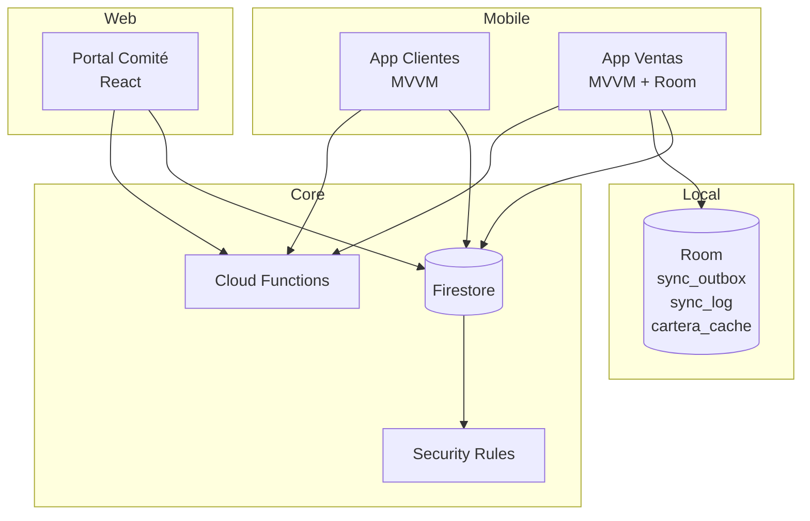
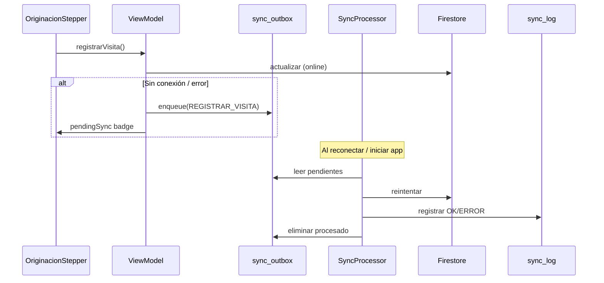

# Arquitectura — Ecosistema CMAC Ica

**Versión:** 1.0.0 · **Backend compartido:** Firebase Firestore (`cajaica`)

## Piezas del ecosistema

| Pieza | Tecnología | Usuario | Paquete / ruta |
|-------|------------|---------|----------------|
| App Clientes | Kotlin + Compose + MVVM | Cliente (DNI) | `CajaIcaHomeBanking` |
| App Ventas | Kotlin + Compose + MVVM + Room | Asesor / Supervisor | `CajaIcaVentas` |
| Portal Comité | React + Vite | Operador comité | `CajaIcaComite` |
| Core backend | Cloud Functions + Firestore Rules | — | `CajaIcaHomeBanking/functions` |

## Modelo de datos compartido

Ver [`DDL/001_bd_core_mobile.sql`](DDL/001_bd_core_mobile.sql) — modelo lógico SQL espejo de Firestore.

```
Firestore (runtime)          SQL lógico (documentación)
─────────────────────        ─────────────────────────
clientes/{uid}           →   cr_cliente
solicitudes_credito      →   cr_solicitud_credito
core_cola                →   cr_core_cola
cartera_dia/.../items    →   cr_cartera_dia
contadores               →   cr_contadores
(Room Ventas) sync_queue →   sync_outbox
(Room Ventas) sync_log   →   sync_log
```

## Arquitectura por capas

### App Clientes — MVVM

```
ui/screens          → Presentación (Compose)
ui/viewmodel        → ViewModel (estado UI)
data/repository     → Repositorios (Firestore)
data/model          → Modelos de dominio
security/           → JWT, RBAC, bloqueo login
```

### App Ventas — MVVM offline-first

```
ui/                 → Presentación (Compose + stepper originación)
ui/viewmodel        → ViewModel
domain/             → Reglas negocio (RF-47, buró, ficha, filtros)
data/repository     → Firestore + offline
data/local/         → Room (cartera_cache, sync_outbox, sync_log)
data/sync/          → Procesador cola sync
security/           → JWT, RBAC
```

### Portal Comité — Capas web

```
components/         → UI React
services/           → Acceso datos (Firestore, API reportes)
security/           → RBAC, tokenStore
```

### Core — Functions (equivalente controlador + servicio)

```
functions/index.js
  checkLoginLock      → Servicio bloqueo
  syncUserRole        → Servicio RBAC (custom claims)
  apiReportes         → API HTTP 401/403
  apiClientePerfil    → API cliente exclusivo
firestore.rules.example → Autorización BD
```

## Diagrama de componentes



## Flujo de sincronización offline (Ventas)



## Convenciones

- **Expediente:** `EXP-{año}-{5 dígitos}` vía `contadores/expedientes`
- **Estados solicitud:** 14 estados (`enviado` → `desembolsado`)
- **Semáforo riesgo:** VERDE / AMARILLO / ROJO (originación + mora)
- **RF-47:** Cronograma francés en `domain/OriginacionEngines.kt`

## Scripts versionados

| Script | Propósito |
|--------|-----------|
| `docs/DDL/001_bd_core_mobile.sql` | DDL modelo lógico |
| `docs/DDL/002_seed_demo.sql` | Datos demo SQL |
| `docs/seed/firestore_demo.json` | Referencia seed Firestore |
| `firestore.rules.example` | Reglas RBAC |
| `firestore.indexes.json` | Índices compuestos |
