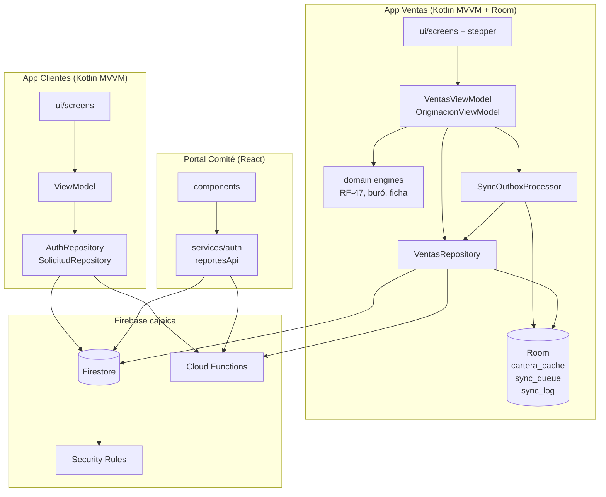
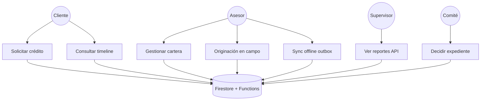
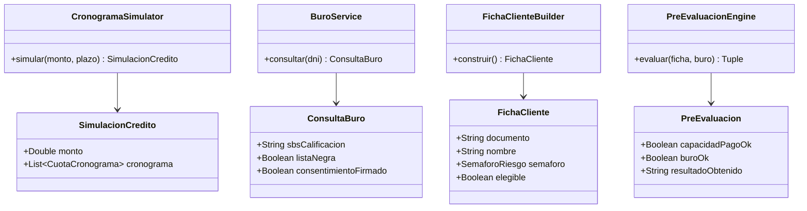
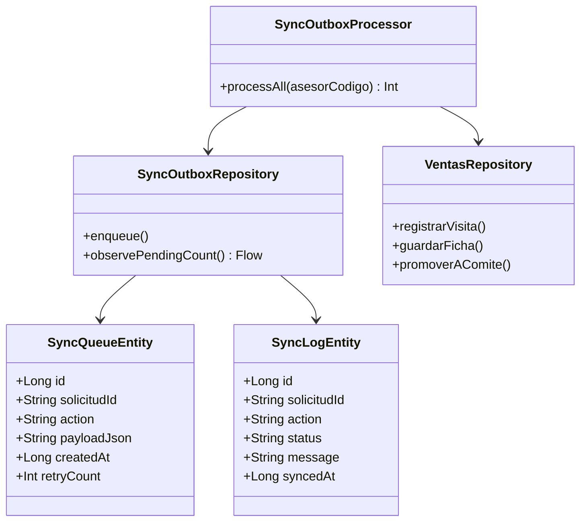
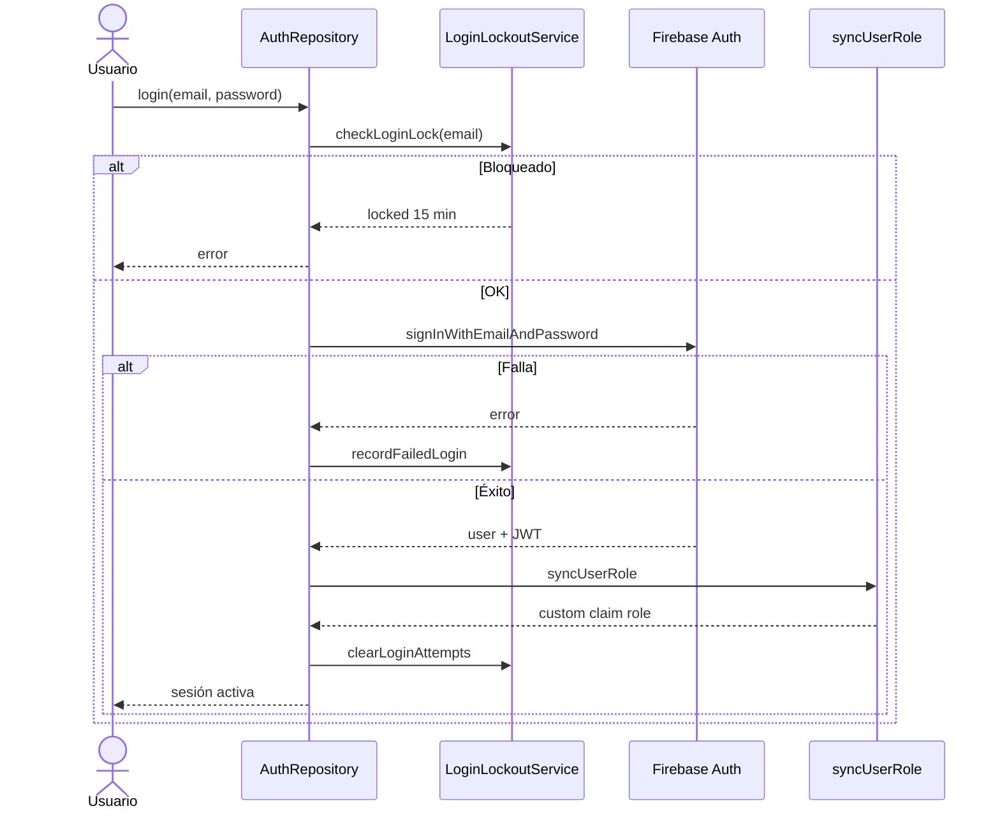
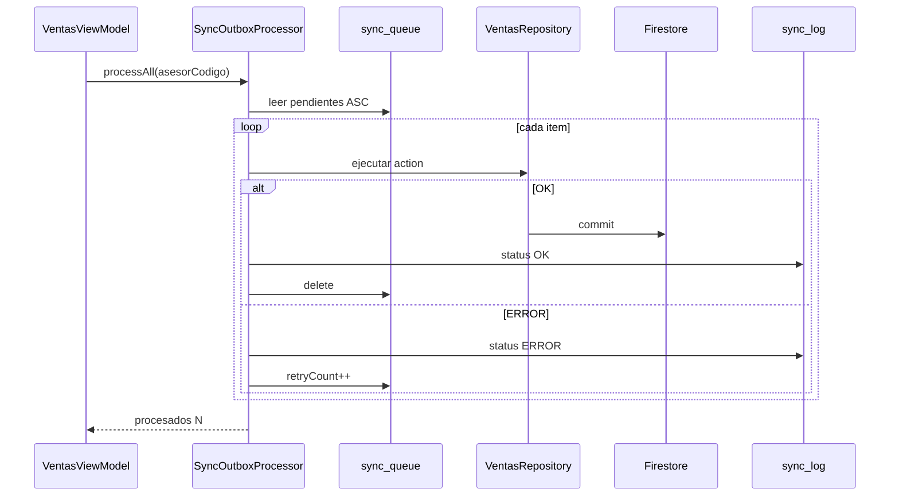
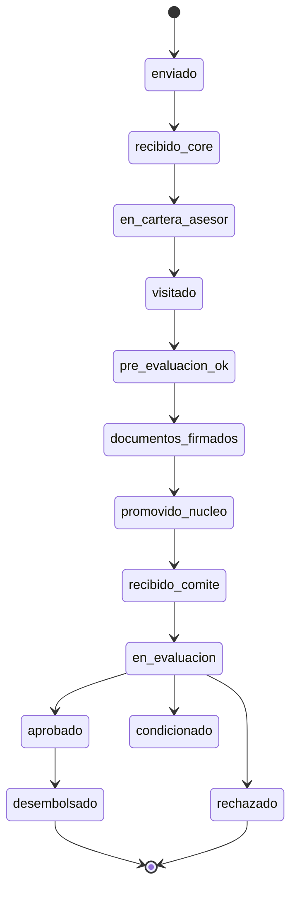
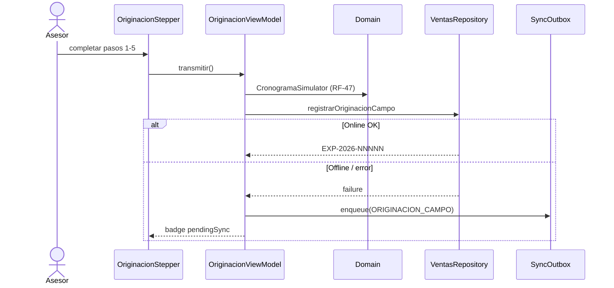

# Diagramas UML — Ecosistema CMAC Ica

Referencia visual complementaria a [`arquitectura.md`](../arquitectura.md) y [`HU-RF-TRAZABILIDAD.md`](../HU-RF-TRAZABILIDAD.md).

## Componentes del ecosistema

## Casos de uso

## Clases — Dominio originación (Ventas)

## Clases — Sync offline (Room)

## Secuencia — Login con RBAC y bloqueo

## Secuencia — Sync outbox al reconectar

## Estados — Solicitud de crédito

## Secuencia — Originación stepper (RF-47)

